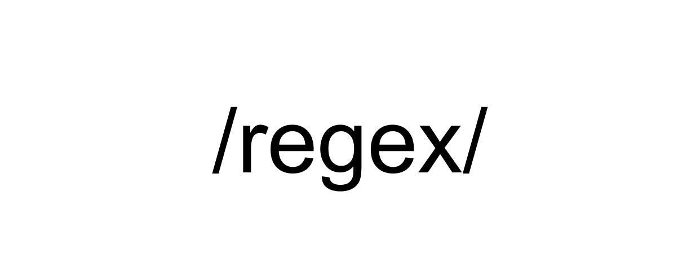

## Regular Expressions

# Description
Long time no see!
This project is about ***Regular Expressions*** in **Ruby**.
All scripts provided is built for the so-called **"Oniguruma"** library.
## Purpose
* To familiarize myself with ***Regular Expressions*** and to advance
into using them in situations like validation, searching and replacing.
## Technologies
* Ruby
