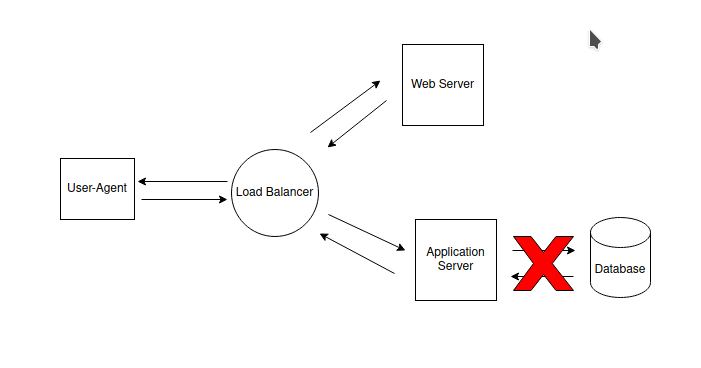

# Incident report (Imginary)

## Issue Summary:
On 13 June 2024 from 9:45 pm to 12:33 am UTC, the main database that is used in my AirBnB Clone project has an issue, that led to the users can't read and updated their data, they were facing 500 error when communicating with the server. Any feature that involved reading and writing data from the database was affected and out. The root cause was a difference between SQLAlchemy Python3 library and MySQL character encoding.

## Timeline:
 * time 9:45 pm - data manipulationg from the database resulted in 500 error.
 * time 9:50 pm - the developers observed the issue while developing a feature.
 * time 9:53 pm - APIs using the database server was made out to fix, the assumption was that the problem comes from one of the libraries used in the backend development.
 * time 10:00 pm - the delay was because revising and searching the documentation to fix the imaginary library error.
 * time 12:25 am - the incident was escalated to one of the backend enginners to solve.
 * time 12:33 am - the issue root was fixed by changing the character encoding of the database to comply with that of the SQLAlchemy library.

## Root cause and resolutiong:
    The root cause was because of using and old exteranl dumpped database file without revising it. That file contained character encoding of type "latin1" while SQLAlchemy library had the character encoding of type 'utf8mb4', the issue was fixed by altering the dump file from removing by changing the characterset to NEW instead of OLD.

## Corrective and preventive measurements:
 * Checking the source of exteranl developing components could be improved.
 * Revising the old dump files with the newer versions of MySQL servers.
 * Testing external database dumpped file.

## Illustrating diagram:
  
